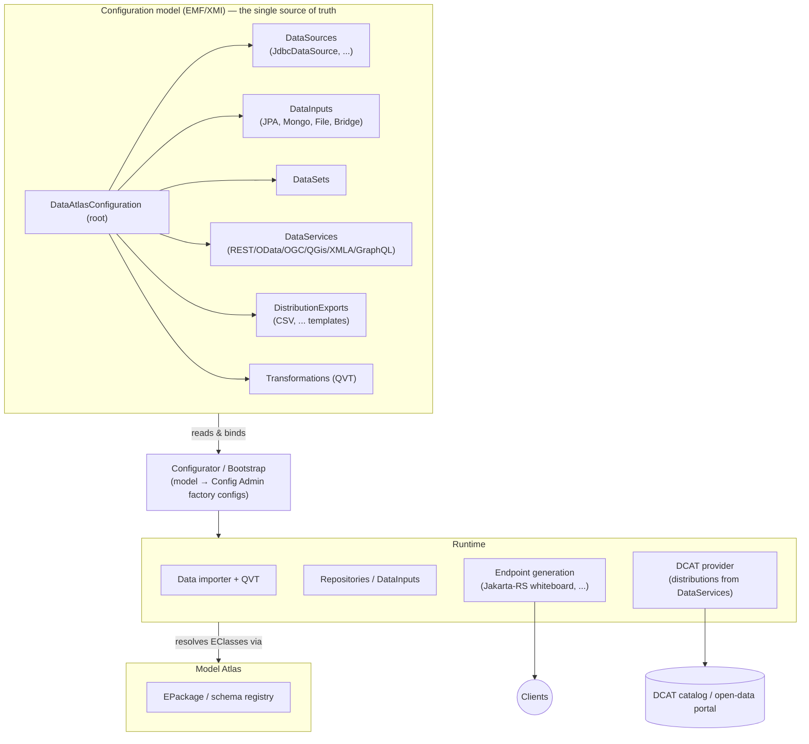

# Data Atlas — Architecture

## Positioning

The **Data Atlas** is the counterpart to the
[Model Atlas](https://github.com/eclipse-fennec/model.atlas):

| | Model Atlas | Data Atlas |
|---|---|---|
| Subject | Schemas & models (`EPackage`, `EClass`) | **Instances / data** (`EObject`) |
| Core question | "Which models exist, how are they versioned/validated?" | "Where does data live, how is it loaded, transformed, and served?" |

## Guiding idea

A Data Atlas instance is described entirely by an **EMF configuration model**
(`DataAtlasConfiguration`, see
[`configuration.ecore`](../org.eclipse.fennec.data.atlas.configuration.model/model/configuration.ecore)).
A **Configurator/Bootstrap** component translates that model into running OSGi
services at runtime — data importers, REST/GraphQL endpoints, DCAT providers.
The model is the single source of truth, not scattered Config Admin JSONs.

## Current state vs. target

Implemented today:

- **Model bundles**: `configuration.model` (configuration/emfmapping/validation
  ecores, generated code) and `dcat.model` (DCAT-AP stack).
- **JPA data plane** (migrated from model.atlas): a folder of `.ecore` models +
  `.eorm` JPA mappings + `.csv` data becomes a JPA-backed (EclipseLink + H2)
  REST endpoint at `/jpa/{rootFolderName}/data/{eClassName}`.
  `DataFolderWatcher` wires the factory-config pipeline per data folder;
  `WorkspaceFolderWatcher` scans a root folder and creates one watcher per
  subfolder. `EMFFileWatcher` registers `.ecore` files from watched folders as
  `EPackage` services.
- **Runtime assembly**: bndruns (`_base`/`_local`/`_docker`) and a distroless
  docker image build.

Not yet migrated (coming from the MDO prototype):

- the Configurator/Bootstrap (model → Config Admin translation),
- the generic data importer (JDBC → PushStream → QVT → repository),
- generic REST/OpenAPI/GraphQL endpoint generation per model,
- the DCAT/Piveau provider.

## Key dependencies

| Stack | Provider |
|---|---|
| EMF on OSGi (EPackage registry, codegen) | [eclipse-fennec/emf.osgi](https://github.com/eclipse-fennec/emf.osgi) |
| JPA persistence (EObject ↔ relational, EclipseLink) | [eclipse-fennec/emf.persistence-jpa](https://github.com/eclipse-fennec/emf.persistence-jpa) via the `fennecJPA` bnd library |
| Codecs / REST serialization | [eclipse-fennec/emf.codec](https://github.com/eclipse-fennec/emf.codec) |
| File watching, JDBC schema/CSV import | [Eclipse Daanse](https://github.com/eclipse-daanse) (`io.fs.watcher`, `sql.jdbc.*` — requires a Java 25 runtime) |
| Jakarta-RS whiteboard | [OSGi Technology REST](https://github.com/eclipse-osgi-technology) + Jersey |
