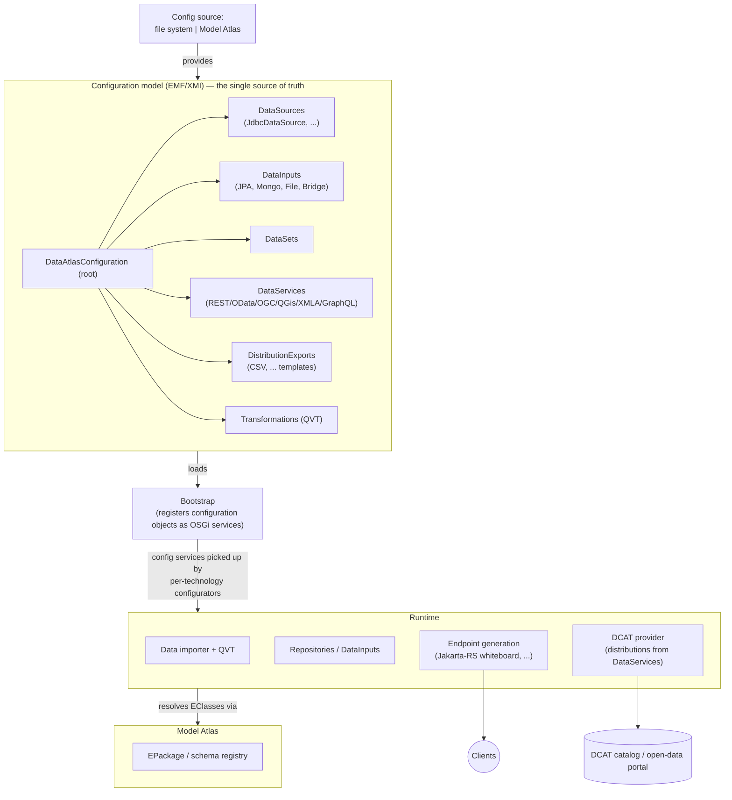

# Data Atlas — Architecture

## Positioning

The **Data Atlas** is the counterpart to the
[Model Atlas](https://github.com/eclipse-fennec/model.atlas):

| | Model Atlas | Data Atlas |
|---|---|---|
| Subject | Schemas & models (`EPackage`, `EClass`) | **Instances / data** (`EObject`) |
| Core question | "Which models exist, how are they versioned/validated?" | "Where does data live, how is it loaded, transformed, and served?" |

## Guiding idea

A Data Atlas instance is described entirely by an **EMF configuration model**
(`DataAtlasConfiguration`, see
[`configuration.ecore`](../org.eclipse.fennec.data.atlas.configuration.model/model/configuration.ecore)).
The model is the single source of truth, not scattered Config Admin JSONs.

The Data Atlas is a separate, horizontally scalable component: multiple
instances can run side by side (e.g. to spread load), each described by its own
`DataAtlasConfiguration`. An instance obtains its configuration in one of two
modes — **from the file system** or **by retrieving it from the Model Atlas**.

**Design decision (2026-08-20): exactly one `DataAtlasConfiguration` per
instance.** An instance is one runtime (one framework, one process/container);
scaling out or separating concerns means running more instances, not feeding
several configurations into one. The `DataAtlasBootstrap` component is
therefore deliberately a singleton, not a factory component.

A **Bootstrap** component loads the model and registers the contained
configuration objects (e.g. each `RestDataService`, each `DataInput`) as OSGi
services. Per-technology **configurator components** pick these config services
up whiteboard-style and create the actual runtime pieces — data importers,
REST/GraphQL endpoints, DCAT providers — and tear them down again when the
config service disappears.

## Current state vs. target

Implemented today (roadmap Milestones 0–4 and 6–8):

- **Model bundle**: `configuration.model` — `DataAtlasConfiguration` root with
  containment registries (data sources, inputs, data sets, services, exports,
  transformations); the JPA mapping type is referenced from the `eorm` model of
  `org.eclipse.fennec.persistence.orm`, a `DataSet` can carry a canonical
  query (`org.eclipse.fennec.query.model`, embedded in the configuration XMI).
  Example instance in `configuration.model/example/`.
- **Inputs are repositories**: every `DataInput` materializes as an upstream
  `ReadRepository` service (`org.eclipse.fennec.persistence.repository.api`),
  correlated via `persistence.repository.id` = input id — there is no
  Data-Atlas-private source SPI. `input.file` registers a read-only,
  file-backed implementation per `FileDataInput`; `input.jpa` translates a
  `JPADataInput` into the fennec persistence factory configurations (EORM
  mapping derived from `supportedEClasses`, entity-mapping persistence unit
  bound to the `JdbcDataSource` filter, read-only `fennec.repository.jpa`),
  whose repository service *is* the input's runtime representation.
- **Serving slice**: `bootstrap` (loads the configuration XMI, registers
  referenced EPackages and the configuration objects as OSGi services), `api`
  (property constants), `rest` (one Jakarta-RS whiteboard application per
  `RestDataService`, reading through per-request repository leases; DataSet
  queries are prepare-validated before an endpoint appears, REST pagination
  pushes down as `skip`/`top`, declared query parameters bind from HTTP query
  parameters; fennec codec serialization), `runtime.config` (resource-only
  Configurator: Felix HTTP + whiteboard + bootstrap config, env-var driven).
- **Export formats are configuration** (Milestone 7): the `DistributionExport`
  templates a DataSet resolves to define the media types its endpoint offers —
  none resolved keeps the JSON/XMI defaults, at least one makes exactly those
  the served set and anything else a `406`. `ExportFormats` in the `rest` bundle
  performs that resolution and translates a `CSVDistributionExport` into the
  fennec codec's CSV options, which the codec's message body writer picks up
  from its per-request option property. `@Produces` lists what the runtime can
  write; the per-DataSet restriction is negotiated in the resource.
- **Model Atlas config mode**: `bootstrap` carries a second component
  (`DataAtlasModelAtlasBootstrap`) that fetches the configuration instance from
  a Model Atlas registry through the model.atlas client stack (per-scope
  `ReadableScopeService`) and feeds the same registrar pipeline; the
  `runtime.config.atlas` Configurator wires the client (env-var driven), and
  the `_docker_atlas` bndrun / `docker/dataatlas-atlas` image package it.
- **DCAT publication** (Milestone 8, data.atlas#4): the omittable
  `publication.dcat` bundle tracks `DataService` configuration services whose
  configuration references a `DcatPublication` and keeps them registered with a
  DCAT.Atlas portal through the dcat.atlas client — DataService-first
  (`dcat:DataService` with the public endpoint URL), its DataSets as
  `dcat:Dataset`, one `dcat:Distribution` per resolved export, and the
  membership links re-asserted on every sync (the portal's PUT replaces).
  Providers that disappear from the configuration are withdrawn. The portal is
  never on the critical path: all portal I/O runs off the config events on one
  worker, transient failures retry, portal-side refusals become a non-retried
  configuration-error state. One `PublicationStatus` service per published
  provider makes the outcome observable; a configuration that declares
  publications with no handler installed is diagnosed by the bootstrap (a
  marker-keyed check — the core has no DCAT dependency, DA-DCAT-1/3). The
  portal endpoint is deployment configuration (the client's Config-Admin
  factory PID); the public base URL comes from
  `DATA_ATLAS_PUBLIC_BASE_URL`.
- **Data transformations** (Milestone 6): the `transformation` bundle turns
  every `DataTransformation` configuration service into a ready-to-execute
  `DataTransformer` (fennec m2x QVT-O engine; the compiled AST — the
  `OperationalTransformation` inside a CompiledUnit document the configuration
  references — is copied with its whole document at registration), and the
  `input.bridge` bundle registers one read-only `ReadRepository` per
  `BridgeRepository` that reads from the source input's repository and
  transforms — the REST layer is untouched, bridges cascade, and the 1:1
  contract (one result per source object, same id) keeps `skip`/`top`
  push-down and by-id lookups correct. Fail-early gating throughout: a
  missing, unresolvable or non-1:1 transformation keeps every dependent
  endpoint down, and the M4 lifecycle recovers it. In Model Atlas mode the
  configuration carries the transformation; the unit document is named by an
  absolute local URI (publishing it into a Model Atlas registry is blocked by
  emf.m2x#246). The transformation configurator builds its engines with the
  package registry of a fresh emf.osgi ResourceSet — the DS QvtoEngine has no
  registry seam and would bind the unit's carried metamodel copies
  (emf.m2x#245).
- **Runtime assembly**: bndruns (`_base`/`_local`/`_docker`/`_docker_atlas`)
  including the JPA/EclipseLink stack, distroless docker images (`file-*` and
  `atlas-*` tags). The images deliberately contain **no** models, configuration
  or data: an instance started without a mount is *unconfigured* — it publishes
  nothing and watches its configuration location, so mounting one later brings
  it up without a restart. Everything an example needs is mounted in, or
  deposited in the Model Atlas. The runtime carries
  the fennec CSV codec and — since Milestone 7 — the daanse PostgreSQL
  `DataSource` provider plus the JDBC driver, so a PostgreSQL deployment needs
  configuration only; other databases still need their own provider bundle. The
  schema always belongs to the database (`eclipselink.ddl-generation` stays
  `none`). OSGi integration tests (`tests`, H2-backed for the JPA slice,
  docker-gated for the compose setups and for the PostgreSQL + CSV example).

Not yet implemented: the other DataService kinds, importers, query
transformations (a bridge with a configured `queryTrafo` stays down) (see the
[roadmap](roadmap.md)).

## Configuration lifecycle

Configuration changes reach a **running** instance without a restart; the
mechanics differ per config source, the application path is shared:

- **Shared diff semantics** (`ConfigurationRegistrar`): every apply is an
  id-keyed diff against the currently published state. EPackages are keyed by
  nsURI and kept while the instance is identical; configuration objects are
  keyed by their id and kept while they are structurally equal
  (`EcoreUtil.equals`) *and* reference no replaced package — everything else
  is re-registered, removed objects are unregistered. Consumers therefore see
  service dynamics only for what actually changed; untouched DataSets keep
  serving through a reload.
- **File mode** (`DataAtlasBootstrap`): a Daanse `io.fs.watcher` whiteboard
  listener watches the configuration file (debounced, 1s) and triggers a
  reload into a fresh ResourceSet; a changed `config.uri` arrives via Config
  Admin (`@Modified`). Note the watchservice matches the listener pattern
  against the **full path string**, not the file name.
- **Model Atlas mode** (`DataAtlasModelAtlasBootstrap`): a scheduled refresh
  polls the registry every `refresh.interval.ms` (default 300000, env
  `DATA_ATLAS_REFRESH_INTERVAL`). The client cache must revalidate at the same
  cadence (`cache.ttl.ms` — unset/≤0 means *cache forever*), which the atlas
  runtime config couples to the same env variable. Updates enter through the
  Model Atlas stage workflow: upload into `draft`, transition to `release`
  (final stages reject direct updates); schemas must be seeded into **both**
  stages, since each stage resolves against its own package view.
- **Failure semantics — fail hard**: a broken new configuration (unresolvable
  proxies, wrong root, deleted file, empty registry entry) tears the published
  configuration down and logs loudly; the watcher/poll keeps running, so a
  corrected version recovers the instance. A transient Model Atlas fetch error
  (network) only warns and keeps the current state.

## Key dependencies

| Stack | Provider |
|---|---|
| EMF on OSGi (EPackage registry, codegen) | [eclipse-fennec/emf.osgi](https://github.com/eclipse-fennec/emf.osgi) |
| Persistence stack (repository facade, JPA/EclipseLink, `eorm`/query/expression models) | [eclipse-fennec/emf.persistence-jpa](https://github.com/eclipse-fennec/emf.persistence-jpa) via the `fennecPersistence` bnd library |
