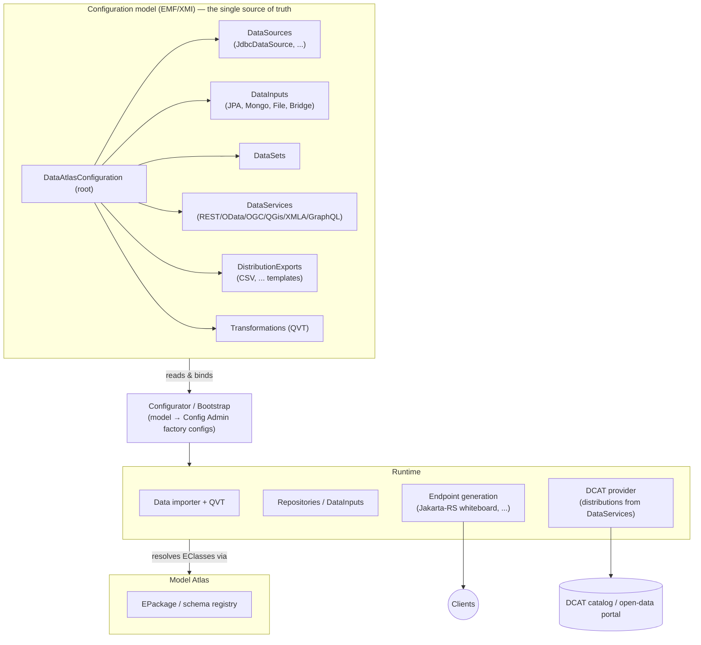

# Data Atlas — Architecture

## Positioning

The **Data Atlas** is the counterpart to the
[Model Atlas](https://github.com/eclipse-fennec/model.atlas):

| | Model Atlas | Data Atlas |
|---|---|---|
| Subject | Schemas & models (`EPackage`, `EClass`) | **Instances / data** (`EObject`) |
| Core question | "Which models exist, how are they versioned/validated?" | "Where does data live, how is it loaded, transformed, and served?" |

## Guiding idea

A Data Atlas instance is described entirely by an **EMF configuration model**
(`DataAtlasConfiguration`, see
[`configuration.ecore`](../org.eclipse.fennec.data.atlas.configuration.model/model/configuration.ecore)).
A **Configurator/Bootstrap** component translates that model into running OSGi
services at runtime — data importers, REST/GraphQL endpoints, DCAT providers.
The model is the single source of truth, not scattered Config Admin JSONs.

## Current state vs. target

Implemented today:

- **Model bundle**: `configuration.model` (configuration/validation ecores,
  generated code; the JPA mapping type is referenced from the `eorm` model of
  `org.eclipse.fennec.persistence.orm`).
- **Runtime assembly**: bndruns (`_base`/`_local`/`_docker`) and a distroless
  docker image build.

The JPA data plane (folder of `.ecore`/`.eorm`/`.csv` → JPA-backed REST) and the
DCAT-AP model stack were removed from this repository and are **out of scope
here**. The remaining runtime functionality (Configurator/Bootstrap, importers,
endpoint generation) is subject to a new plan.

## Key dependencies

| Stack | Provider |
|---|---|
| EMF on OSGi (EPackage registry, codegen) | [eclipse-fennec/emf.osgi](https://github.com/eclipse-fennec/emf.osgi) |
| JPA mapping model (`eorm`, build-time genmodel reference) | [eclipse-fennec/emf.persistence-jpa](https://github.com/eclipse-fennec/emf.persistence-jpa) via the `fennecJPA` bnd library |
